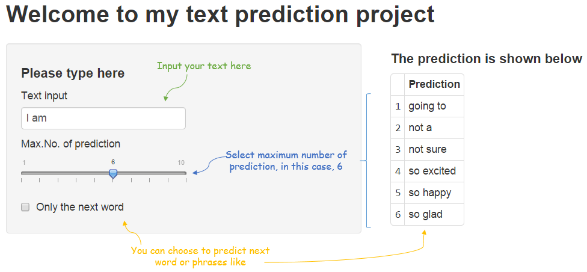

SwiftKey Project
========================================================
author: Fred Zheng Zhenhao
date: 2014/12/10
font-family: 'Helvetica'
<font  color="yellow"><i>Remark:</i></font> <i>please follow this link for shinyapp.

http://fredzheng.shinyapps.io/Swiftkey/

Or  please delete the "s" from "https" in my submission, I am sorry for the trouble caused.</i>

Interface
========================================================
Screenshot



Backoff Model
========================================================

This backoff model takes following steps:
  1. Look up the prediction in **Trigram model**
  2. If no match is found, look up the **bigram model** for prediction
  3. If still no match is found, look up the **unigram model**
  4. If again no match is found, use the **most frequent words** as prediction

I also coded a weghted algorithm to compare the accuracy -- see next slide

Advantages -- Time
========================================================


```r
## What we use -- backoff model
system.time(backoff("Nice to")) 
```

```
   user  system elapsed 
   0.02    0.00    0.01 
```

```r
## Combination of 1,2,3-gram
system.time(weighted("Nice to"))
```

```
   user  system elapsed 
   0.08    0.00    0.08 
```
Since the model does not need to evaluate every model, it takes very little time to give a prediction. 

Because of this speed, this app can perform **real time prediction**.


Accuracy & size
========================================================

We tested accuracy in a test set with 786 entries, and the accuracy of one prediction is **11.5%**. 

However, if we allow 2 predictions, the accuracy will increase to **14.4%**, and if we allow 5 predictions, the accuracy will be **23.2%**.

What's more, it only takes **1.66M** to download (core part). 

<i>Again, please follow this link to see the app, many thanks (http://fredzheng.shinyapps.io/Swiftkey/)</i>

  
